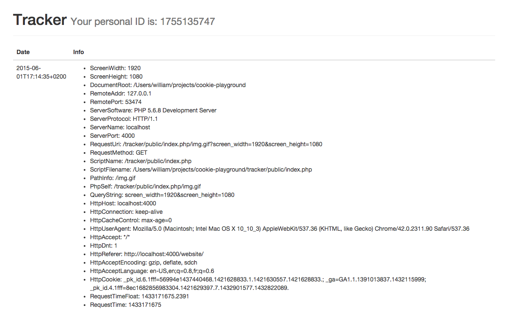

Cookie Playground
=================

This project contains two parts: `tracker` and `website`, and is intended to
show how cookies can be used to track you and send a lot of information to an
third-party service.

## Installation

Install the project by first cloning it (`git clone ...`), then install the
project's dependencies:

    $ composer install

Now, run the application:

    $ php -S localhost:4000 -t .

**Note:** in case you don't want `4000` as port, you will have to update the
port number in `tracker/public/tracker.js` (sorry).

## Usage

The _tracker_ exposes a dashboard at:
`http://localhost:4000/tracker/public/dashboard`.

The _website_ does not do much, but is available at:
`http://localhost:4000/website/`.

### Tracker

The tracker is responsible for serving a single-pixel image along with a cookie,
and, of course, persisting as much client data as possible. It automatically
assigns an identifier when not found, and aggregates all data by identifier.
When looking at the dashboard, you will only get your own information, but it
would be easy to build a better view to see all information available.

The tracker also offers a simple JavaScript file that is used to build a request
to fetch the single-pixel image from the websites using the service.

### Website

The website requires a JavaScript file from the tracker (à la Google Analytics
or Piwik). That's it.

### Next?

Go ahead and hack the project! You can pass as many data as you wish to by
updating the `tracker/public/tracker.js` script.

License
-------

This project is released under the MIT License. See the bundled LICENSE file for
details.
